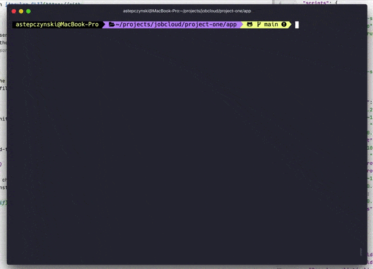
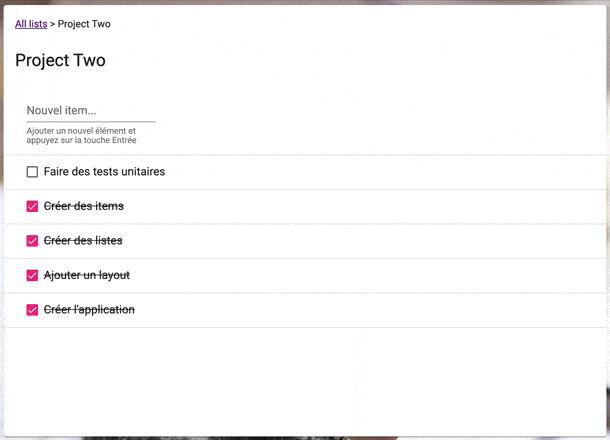

# App

This project was generated with [Angular CLI](https://github.com/angular/angular-cli) version 10.2.0. It mainly use [NgRx](https://ngrx.io/) for managing the states (store, effects, router-store, entity). Since [Material](https://material.angular.io/) was asked to work with, the project will also use [Flex Layout](https://github.com/angular/flex-layout), *and that's a first.*

## Development server

Run `npm run start` for a dev server. 
This command will run as well the `json-server` and will serve the angular application. 
If you prefer to launch the `json-server` in another tab, please use `npm run json-server` and `npm run serve` 

## Build

Run `npm run build` to build the project. The build artifacts will be stored in the `dist/` directory. Use the `--prod` flag for a production build. 
**Once built**, you can serve files using `npm run serve:build`

## Running unit tests

Run `npm run test` to execute the unit tests via [Karma](https://karma-runner.github.io).

## Running end-to-end tests

Run `npm run e2e` to execute the end-to-end tests via [Protractor](http://www.protractortest.org/). The `json-server` will be launched automatically and will target `e2e-db.json`

## Async Validators (List Name)

Double-click on a list name to change its name. \
The name will be verified against other list names owned by the same user.

